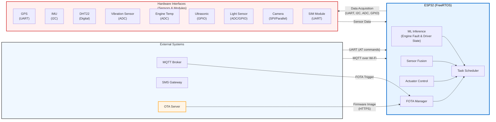

# NOVA - Networked Onboard Vehicle Analytics

NOVA is an advanced AIoT (Artificial Intelligence of Things) vehicle monitoring and safety system developed as the final project for an internship at the National Telecommunication Institute (NTI).

The system transforms a standard vehicle into an intelligent, connected platform by combining real-time sensor data, edge-based machine learning, sensor fusion, and remote telemetry to enhance driver safety, vehicle security, and predictive maintenance.

## Features

- Accurate Location Tracking  
  GPS + IMU sensor fusion for continuous positioning (even during temporary GPS loss)

- Cabin Environment Monitoring  
  Temperature and humidity sensing using DHT22

- Predictive Engine Health Monitoring  
  Vibration + engine temperature analysis with on-device ML model (faulty / not faulty classification)

- Driver Safety & Fatigue Detection  
  Camera-based drowsiness and distraction detection using edge ML

- Security Features  
  Ultrasonic sensor for prolonged presence detection near driver door (anti-theft alert)

- Headlight Status Monitoring  
  Detection of front light failure/damage

- Critical Alerting  
  Instant SMS notifications via GSM module for high-priority events

- Remote Telemetry  
  Real-time data publishing to MQTT broker over Wi-Fi (JSON payloads)

- Real-Time Multitasking  
  Efficient task management using FreeRTOS on ESP32
  
- Firmware Over-The-Air (FOTA) Updates  
  Secure remote firmware updates using MQTT-triggered OTA and HTTPS download,
  enabling bug fixes, feature enhancements, and ML model updates without physical access.

## Hardware Components

| Component                  | Interface   | Purpose                              |
|----------------------------|-------------|--------------------------------------|
| ESP32 (DevKit / Custom)    | -           | Main microcontroller                 |
| GPS Module                 | UART        | Location tracking                    |
| IMU (e.g., MPU-6050)       | I2C         | Motion data & sensor fusion          |
| DHT22                      | Digital     | Cabin temperature & humidity         |
| Vibration Sensor + Temp    | ADC         | Engine health input for ML           |
| Ultrasonic Sensor          | GPIO        | Proximity detection (driver door)    |
| Light Sensor / Current     | ADC/GPIO    | Headlight status                     |
| Camera Module (e.g., OV2640)| SPI/Parallel| Driver state monitoring              |
| SIM Module (e.g., SIM800L) | UART        | SMS alerts                           |

## System Architecture

The system architecture includes a secure Firmware Over-The-Air (FOTA) mechanism.
Firmware updates are triggered via MQTT and downloaded securely over HTTPS from
a dedicated OTA server using a dual-partition update strategy.

## Machine Learning Models

NOVA incorporates two custom-trained, lightweight machine learning models optimized for on-device inference on the resource-constrained ESP32 microcontroller using TensorFlow Lite for Microcontrollers.

### 1. Engine Health Monitoring Model
- **Objective**: Binary classification to detect anomalous (faulty) engine conditions vs. normal operation.
- **Input Features**:
  - Vibration magnitude and frequency characteristics (extracted from raw ADC readings via FFT or statistical features: RMS, peak-to-peak, variance)
  - Engine temperature (normalized ADC value)
- **Training Pipeline**:
  - Feature engineering in Python (NumPy/SciPy)
  - Model architecture: Small fully-connected neural network or quantized decision tree
  - Quantization: Full integer quantization (8-bit) to reduce model size (< 50 KB) and inference time
- **Output**: Fault probability + confidence score; triggers alert if threshold exceeded

### 2. Driver State Monitoring Model
- **Objective**: Detect signs of drowsiness or distraction (e.g., eyes closed, yawning, head pose deviation).
- **Input**: Pre-processed face-region images captured from the in-cabin camera.
- **Training Pipeline**:
  - On-device face detection and cropping (lightweight Haar cascade or tiny CNN)
  - Classification model: Depthwise separable convolutional neural network (inspired by MobileNetV1 with alpha 0.25) or custom tiny CNN
  - Transfer learning + fine-tuning on collected dataset
  - Quantized to 8-bit integers for edge deployment (model size < 100 KB)
- **Output**: Drowsy/Distracted probability; triggers escalating alerts (MQTT notification → SMS if persistent)

Both models were trained, validated, and optimized by the NTI internship team to ensure efficient execution within ESP32 memory and power constraints.

## Documentation

- Software Requirements Specification (SRS)
- Project Proposal
- System Design Document

All available in the `/doc/` and `System_Architecture`folder.

## License

This project is licensed under the MIT License - see the [LICENSE](LICENSE) file for details.

---

NOVA – Turning vehicles into intelligent, connected, and safer platforms.
